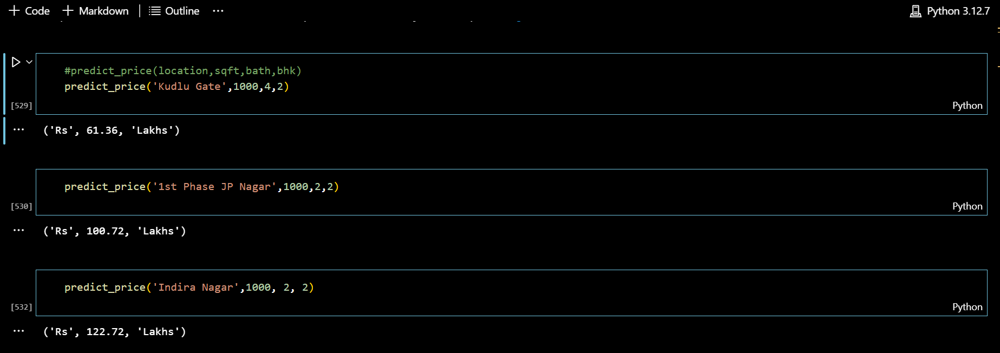

# CodeClauseInternship_Housing-Price-Prediction
# 🏡 **Housing Price Prediction Using Machine Learning**

### 🎯 **Objective:**
The goal of this project is to build a machine learning model that predicts housing prices based on features such as location, square footage, number of bathrooms, and number of bedrooms. The model will allow users to input details about a property and receive an estimated price in real-time. This tool aims to assist buyers, sellers, and real estate agents in making informed decisions regarding property values in various locations.

---

### 📷 **Screenshots**

---

### 📊 **Model Accuracy**
- **Linear Regression Score**: `0.938990990666642` or `93.9%`
- 

---

### 🛠️ **Tech Stack**

- **Development Environment**:
  - 🖥️ **VS Code**: For writing and executing code.
  - 📓 **Jupyter Notebook**: Used within VS Code for running Python scripts interactively.

- **Programming Language**:
  - 🐍 **Python**: The entire project is implemented in Python.

- **Machine Learning Libraries**:
  - 📚 **Scikit-learn**: For training machine learning regression models to predict housing prices.
  - 🐼 **Pandas** & 🧮 **NumPy**: For data preprocessing and manipulation.

---

### 🛤️ **Roadmap**

#### 1️⃣ **Understanding the Problem and Dataset**:
- **Objective**: Clearly define the problem (predict housing prices based on several features).
- **Dataset**: Gather the required dataset, which includes features like location, square footage, number of bathrooms, and number of bedrooms. Ensure it's clean and relevant.

#### 2️⃣ **Data Collection & Exploration**:
- 📊 **Acquire the dataset**: Obtain a dataset of housing prices from **Kaggle** or other sources. Ensure it contains relevant features such as location, size, bedrooms, bathrooms, and price.
- 🔍 **Exploratory Data Analysis (EDA)**:
  - Visualize the distribution of features.
  - Check for missing values, outliers, and data imbalance.
  - Use **Pandas**, **Seaborn**, and **Matplotlib** for EDA.

#### 3️⃣ **Data Preprocessing**:
- 🧹 **Handling Missing Values**: Use techniques like mean/median imputation or drop rows/columns if necessary.
- 🏗️ **Feature Engineering**:
  - Convert categorical variables (like location) into numerical format (e.g., one-hot encoding).
  - Scale numerical features (e.g., square footage) if necessary.
- ✂️ **Train-Test Split**: Split the dataset into training and testing sets (e.g., 80% train, 20% test) using `train_test_split` from **Scikit-learn**.

#### 4️⃣ **Model Building & Model Selection**:
- 🏗️ Use machine learning algorithms like **Linear Regression**, **Decision Tree Regressor**, or **Random Forest Regressor** to predict housing prices.
- 🔧 Train each model on the training dataset.

---

### 🧪 **Testing the Output**
- 📈 **Test the Model**: Use the testing dataset to evaluate the model's performance.
- 🔢 **Prediction**: Predict housing prices based on the input features (location, size, number of bathrooms, and number of bedrooms).
- ⚖️ **Compare**: Compare predicted values with actual values to assess the accuracy of the model.

---

### 👨‍💻 **Author**
- **[Mohammed Saad Fazal](https://github.com/Mdsaad07)**
